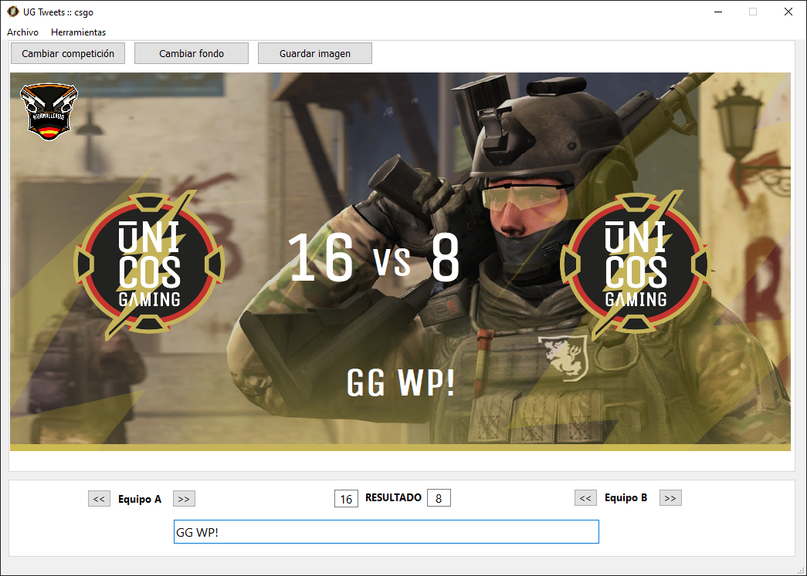

# UG Tweets

This application allows to configure a base image adding it the results of a match and the logos of the different teams. The final image can be saved to be used later to be published on tweets.



## Run
```
python3 generator.py
```

## Create the installer
```
pyinstaller generator.spec
```

## Copyright
The logos on the screenshot image belong to the [National League España CSGO](https://nationaleague.com/) and [Únicos Gaming](https://unicosgaming.es/)